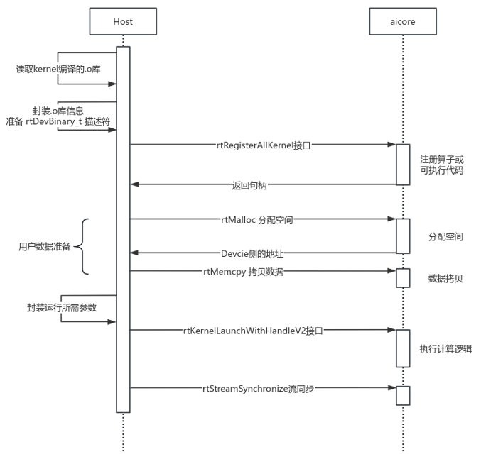

AICORE kernel launch
======================
本节介绍使用 CANN 运行时 API 创建并启动 AICORE 内核，涵盖从注册 AICORE kernel 到执行的完整流程。

AICORE 核函数
-------------------

AI Core 与 AI CPU 上的函数存在明显差异：AI Core 函数通常需通过特定的函数限定符显式标识，以指示其将在昇腾芯片的 AI 计算单元上执行。
这类函数不能直接用通用编译器打包为标准 `.so` 文件，而必须通过毕昇编译器进行交叉编译和优化，生成由 CANN 运行时加载的专用算子库，然后通过固定接口注册。

.. code-block:: cpp

    #ifdef __AIV__
    #define KERNEL_ENTRY(x) x##_0_mix_aiv
    #else
    #define KERNEL_ENTRY(x) x##_0_mix_aic
    #endif

    extern "C" __global__ __aicore__ void KERNEL_ENTRY(aicore_kernel)(__gm__ uint8_t *args, int64_t Stride) {
    #ifdef __AIV__
        ...
    #else
        ...
    #endif
    }

AICORE核函数通常使用 extern "C" 按照类C的编译和连接规约来编译和连接，\_\_global\_\_函数类型限定符表示它是一个核函数， \_\_aicore\_\_函数类型限定符表示该核函数在device侧的 AICORE 上执行。
参数列表中的变量类型限定符 \_\_gm\_\_ ，表明该指针变量指向Global Memory上某处内存地址。

在昇腾编程中，所有指向 global memory 的指针都必须显式声明为 __gm__ T*，即使是转类型换时目标类型也必须带 __gm__，例如
``auto devArgs = (__gm__ DeviceArgs *)args;``

AI Core 核函数可被编译为两种目标架构：AIC（AI Cube 核） 或 AIV（AI Vector 核），通过动态生成不同的函数名加以区分。

整体流程
-------------------

:numref:`launch-aicore-fig` 展示了Host 端调用 AICORE 内核的过程涉及多个阶段的数据交互与资源准备，
整体流程可概括为“库加载与注册 → 参数构造 → kernel launch → 流同步”四个步骤。

.. _launch-aicore-fig:

   AICORE kernel启动流程示意图

1. 二进制库的加载与注册
    Host 读取毕昇编译器编译的kernel代码，调用 ``rtRegisterAllKernel`` 接口将kernel注册到AICORE，确保其可被统一发现和调用。

#. 参数构造
    用户设定使用的block数量、准备kernel所需的参数封装进 ``rtArgsEx_t`` ，并将计算需要的数据拷贝到Device侧。

#. kernel launch
    调用 ``rtKernelLaunchWithHandleV2`` 接口触发AICORE kernel的执行.

#. 流同步
    调用 ``rtStreamSynchronize`` 进行流同步，之后可将Device侧的数据拷贝回Host侧.

`block` 代表一个 AI Core 单元，包含 1 个 Cube 核与 2 个 Vector 核（即 1C2V 架构）。与 AICPU kernel 不同，AICore kernel 需显式注册到昇腾设备后才能在 AICore 上执行。

.. code-block:: cpp

    rtDevBinary_t binary;
    std::memset(&binary, 0, sizeof(binary));
    binary.magic = RT_DEV_BINARY_MAGIC_ELF;
    binary.version = 0;
    binary.data = binData;
    binary.length = binSize;
    void *binHandle = nullptr;
    rc = rtRegisterAllKernel(&binary, &binHandle);

``rtDevBinary_t`` 是 CANN 定义的结构体，用于描述一段设备可执行代码的元信息。 ``RT_DEV_BINARY_MAGIC_ELF`` 作为协议魔数，用于告知驱动这是一段符合昇腾规范的 ELF 格式设备二进制。

调用 ``rtRegisterAllKernel(&binary, &binHandle)`` 会将二进制提交给 CANN 驱动，由其验证魔数、解析 ELF、提取 AI Core/AIV kernel 符号并建立函数名到设备入口的映射，最终返回句柄 ``binHandle`` 。
整个注册过程不会触发 AICore 的执行，其本质是“备案”而非“运行”。

