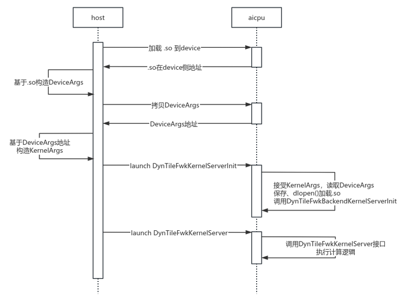

AICPU kernel launch
====================

本节介绍如何使用 CANN 运行时 API 创建并启动 AICPU 内核，涵盖从加载内核二进制文件到在设备上执行的完整流程。
主要示例代码位于 **basics/03-aicpu-kernel**。

AICPU 核函数
--------------------

AI CPU 上的函数与 Host CPU 上运行的函数类似，通常无需添加特殊的函数限定符。
AICPU kernel往往被打包为.so文件，拷贝到device侧，必须通过 CANN 提供的固定运行时接口来间接执行。

.. list-table::
   :header-rows: 1
   :widths: auto

   * - System Kernel Name
     - Backend Function Name
   * - ``DynTileFwkKernelServerInit``
     - ``DynTileFwkBackendKernelServerInit``
   * - ``DynTileFwkKernelServer``
     - ``DynTileFwkBackendKernelServer``
   * - ``StaticTileFwkKernelServer``
     - ``StaticTileFwkBackendKernelServer``
    
系统kernel（libaicpu_extend_kernels.so） 作为 AICPU 内核入口，会进一步调用用户提供的后端服务动态库中与之对应的函数。

整体流程
--------------------

:numref:`launch-aicpu-fig` 展示了Host 端调用 AICPU 内核的过程涉及多个阶段的数据交互与资源准备，
整体流程可概括为“动态库加载 → 参数构造 → kernel launch → 流同步”四个步骤。

.. _launch-aicpu-fig:

   AICPU kernel启动流程示意图

1. 动态库加载：
    Host 首先将用户自定义的 .so 文件通过 ``rtMalloc`` 和 ``rtMemcpy`` 加载至设备内存，并获取其在设备侧的虚拟地址。该地址后续用于参数结构体的构建与函数调用。

#. 参数构造：
    基于加载信息，Host 构造 ``DeviceArgs`` 结构体，并将其从 Host 内存拷贝至设备端。
    随后，Host 利用该地址进一步构建 ``KernelArgs``。

#. kernel launch：
    调用 ``rtStreamCreate`` 创建 ``stream`` 流队列 ，通过 ``rtAicpuKernelLaunchExWithArgs`` 接口将 ``KernelArgs`` 和 ``stream`` 等参数提交至设备执行上下文，并触发 ``DynTileFwkKernelServerInit`` 和 ``DynTileFwkKernelServer`` ，完成函数调用。

#. 流同步：
    计算的最后通过 ``rtStreamSynchronize``，确保 Host 在继续执行前，指定 ``stream`` 上的所有 Device 操作已真正完成。

``DeviceArgs`` 主要为Device提供完整的硬件拓扑、内存布局、任务配置和自定义 `.so` 加载信息，确保能够正确初始化执行环境并启动用户 Kernel。

``KernelArgs`` 常用于 AI CPU 或 AI Core 自定义算子在Device执行时所接收的 **运行时** 参数块，主要用于传递内存地址、配置数据和硬件上下文信息，供用户实现的 Kernel 函数使用。
当然， ``KernelArgs`` 直接传入Device，而是通过 ``rtAicpuArgsEx_t`` 构进行封装。

.. code-block:: cpp

  struct Args {
      KernelArgs kArgs;
      char kernelName[32];
      const char soName[32] = {"libaicpu_extend_kernels.so"};
      const char opName[32] = {""};
  } args;

  args.kArgs = *kArgs;
  std::strncpy(args.kernelName, kernelName, sizeof(args.kernelName) - 1);
  args.kernelName[sizeof(args.kernelName) - 1] = '\0';

  rtAicpuArgsEx_t rtArgs;
  std::memset(&rtArgs, 0, sizeof(rtArgs));
  rtArgs.args = &args;
  rtArgs.argsSize = sizeof(args);
  rtArgs.kernelNameAddrOffset = offsetof(struct Args, kernelName);
  rtArgs.soNameAddrOffset = offsetof(struct Args, soName);

  return rtAicpuKernelLaunchExWithArgs(rtKernelType_t::KERNEL_TYPE_AICPU_KFC, "AST_DYN_AICPU", aicpuNum, &rtArgs, nullptr, stream, 0);

这是因为Device实际执行的并非用户 Kernel 本身，而是 CANN 预置的通用调度库（libaicpu_extend_kernels.so），该调度器需要明确知道：要加载哪个动态库（.so 文件名）、调用哪个函数（Kernel 名），以及用户参数的具体位置。

``rtAicpuArgsEx_t`` 正是 Host 与 Device 之间的标准通信契约——它不仅携带完整的参数内存块（含 KernelArgs、kernelName 和 soName），还通过 ``kernelNameAddrOffset`` 和 ``soNameAddrOffset`` 显式声明关键字段在内存中的偏移量，使设备侧调度器能安全、准确地解析并动态加载用户 Kernel。

LOG组件
--------------------
昇腾 CANN 架构强调 Host/Device 隔离，所有通信必须通过受控通道（如日志系统、共享内存、队列），标准 C/C++ 运行时所提供的主机端 I/O 机制（如流式输出、格式化打印等）并不适用于设备执行环境。

是以，Device侧的信息往往通过平台提供的日志接口进行信息的输出。具体实现见 **basics/03-aicpu-kernel/kernel/device_log.cpp**。
日志的落盘位置为 ``~/ascend/log/debug/device-<device_id>/``。