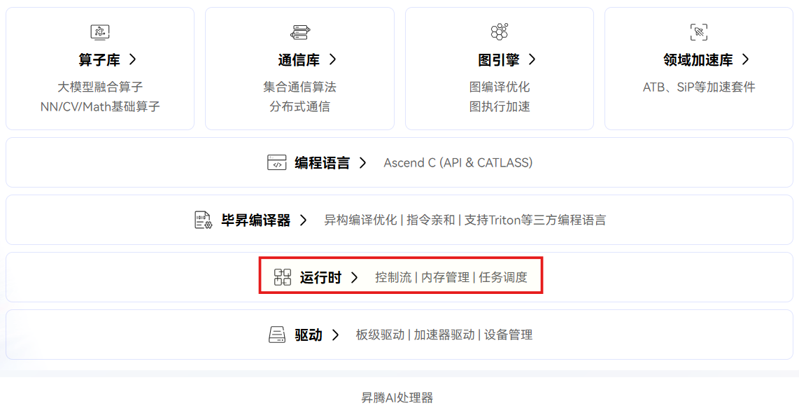
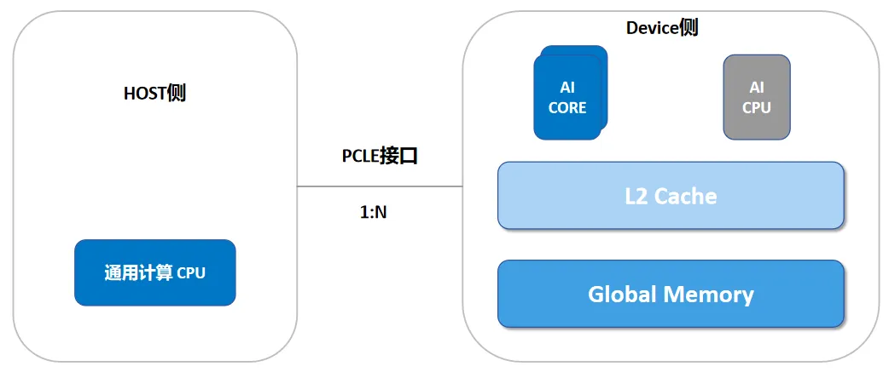

CANN
========

CANN 介绍
------------
CANN（Compute Architecture for Neural Networks）是华为针对AI场景推出的异构计算架构，对上支持多种AI框架，对下服务AI处理器与编程，发挥承上启下的关键作用。

在硬件层面，昇腾 AI 处理器所包含的达·芬奇架构在硬件设计上进行计算资源的定制化设计，在功能实现上进行深度适配，为神经网络计算性能的提升提供了强大的硬件基础。
在软件层面，CANN 所包含的软件栈则提供了管理网络模型、计算流以及数据流的功能，支撑起神经网络在异构处理器上的执行流程。

Runtime组件：提供Ascend NPU运行时用户编程接口和运行时核心实现，包括设备管理、流管理、Event管理、内存管理、任务调度等功能。

Runtime 不只是“服务某一个框架”，而是为更广泛的 AI 软件生态提供通用能力。不需要从头造轮子，可以从一个调度策略、一个内存优化、一个可观测性改进开始。

昇腾介绍
-----------
昇腾计算架构分为Host侧和Device侧。Host指与昇腾AI处理器所在硬件设备相连接的X86服务器、ARM服务器。Device则指安装了昇腾AI处理器的硬件设备，利用PCIe接口与服务器连接。
而Host和Device拥有不同的内存空间，Host（DDR）往往无法直接访问Device（HMB）内存。

昇腾 AI 处理器的核心计算单元是 AI Core，单颗芯片内集成多个 AI Core。
从控制上可以看成是一个相对简化的现代微处理器的基本架构。它包括了三种基础计算资源：矩阵计算单元（Cube Unit）、向量计算单元（Vector Unit）和标量计算单元（Scalar Unit）。
这三种计算单元各司其职，形成了三条独立的执行流水线，在系统软件的统一调度下互相配合达到优化的计算效率。

除了AI Core以外，昇腾 AI 处理器还集成了若干 AI CPU 核心，用于执行控制类算子以及轻量级的标量和向量通用计算，承担任务调度、分支判断和预处理等职责。